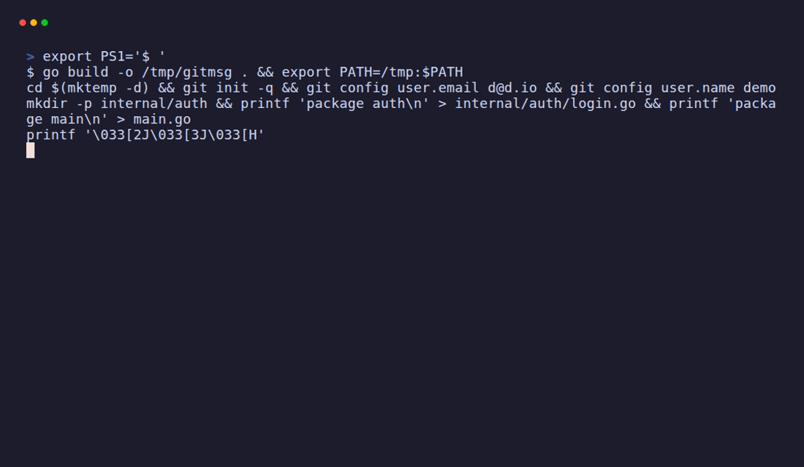

# gitmsg

> Stop writing commit messages. Let your diff do it.

**gitmsg** reads your staged changes and writes a clean [Conventional Commit](https://www.conventionalcommits.org/) message — or a full pull request description — in milliseconds. It works **100% offline** with smart heuristics, and gets even better when you plug in an AI key.



```console
$ git add .
$ gitmsg
feat(git): add staging helpers

- add internal/git/git.go
- update main.go
```

```console
$ gitmsg -a -c
Committed:
  fix(analyze): handle empty diff
```

- ⚡ **Instant** — a single static binary, no runtime, no dependencies.
- 🔌 **Offline first** — useful with zero configuration. No API key required.
- 🧠 **Optional AI** — set `OPENAI_API_KEY` for richer messages on demand.
- 📝 **Conventional Commits** — correct `type(scope): summary` every time.
- 🔀 **PR descriptions** — turn a branch of commits into a clean PR body.
- 🪟 **Cross-platform** — Linux, macOS, and Windows.

---

## Install

### Homebrew

```sh
brew install djaferiurim/tap/gitmsg
```

### Go

```sh
go install github.com/djaferiurim/gitmsg@latest
```

### Linux packages

Grab a `.deb`, `.rpm`, or `.apk` from the [releases page](https://github.com/djaferiurim/gitmsg/releases):

```sh
# Debian / Ubuntu
sudo dpkg -i gitmsg_*_linux_amd64.deb

# Fedora / RHEL
sudo rpm -i gitmsg_*_linux_amd64.rpm
```

### From source

```sh
git clone https://github.com/djaferiurim/gitmsg
cd gitmsg
make install
```

> Replace `djaferiurim` with your GitHub handle if you fork this.

---

## Usage

```text
gitmsg [flags]

  gitmsg                 Print a suggested commit message for staged changes
  gitmsg -a -c           Stage tracked changes and commit with the message
  gitmsg --amend         Rewrite the last commit message from its changes
  gitmsg --type fix      Force the commit type
  gitmsg --scope api     Force the commit scope
  gitmsg --pr            Generate a pull request title and body
  gitmsg --install-hook  Auto-fill messages on every commit
```

| Flag | Description |
|------|-------------|
| `-c`, `--commit` | Create the commit using the generated message |
| `--amend` | Amend the last commit with the generated message |
| `-a`, `--all` | Stage all tracked changes before generating |
| `--pr` | Generate a pull request title and description |
| `--base BRANCH` | Base branch for `--pr` (default: auto-detected) |
| `--type TYPE` | Override the commit type (`feat`, `fix`, `docs`, ...) |
| `--scope SCOPE` | Override the commit scope |
| `--body` | Include a bullet body for multi-file commits (default `true`) |
| `--ai` / `--no-ai` | Force or disable AI generation |
| `--dry-run` | Print what would happen without committing or writing files |
| `--install-hook` | Install a `prepare-commit-msg` hook in this repo |
| `-v`, `--version` | Print version and exit |

### Suggested git alias

```sh
git config --global alias.cm '!gitmsg -c'
# now: git cm
```

### Auto-fill on every commit (git hook)

Install a `prepare-commit-msg` hook so `git commit` opens with a message
already filled in:

```sh
gitmsg --install-hook
```

The hook is conservative: it never overwrites a message you typed yourself,
and it stays out of the way for merges, `git commit -m`, and rebases. Remove
it any time by deleting `.git/hooks/prepare-commit-msg`.

Preview what the hook (or any commit) would produce without changing anything:

```sh
gitmsg --dry-run -c          # show the message, don't commit
gitmsg --dry-run --install-hook   # show the hook path and contents
```

### Shell completions

```sh
# bash
gitmsg completion bash > /etc/bash_completion.d/gitmsg

# zsh (ensure the dir is on your $fpath)
gitmsg completion zsh > "${fpath[1]}/_gitmsg"

# fish
gitmsg completion fish > ~/.config/fish/completions/gitmsg.fish
```

Or load them for the current session: `source <(gitmsg completion bash)`.

---

## How it works

gitmsg inspects `git diff --cached` and classifies your changes locally:

- **Type** is inferred from the files you touched — docs, tests, CI, build files,
  new features (added files) or fixes (modifications).
- **Scope** is the common directory of your changes (e.g. `internal/git` → `git`).
- **Summary** is an imperative one-liner describing what changed.

No data leaves your machine in offline mode.

---

## AI mode (optional)

Set an API key to generate messages with an OpenAI-compatible model:

```sh
export OPENAI_API_KEY=sk-...
gitmsg            # now uses AI automatically
gitmsg --no-ai    # force offline heuristics
```

| Variable | Default | Purpose |
|----------|---------|---------|
| `GITMSG_API_KEY` / `OPENAI_API_KEY` | — | Enables AI generation |
| `GITMSG_MODEL` | `gpt-4o-mini` | Model name |
| `GITMSG_API_URL` | `https://api.openai.com/v1/chat/completions` | Any OpenAI-compatible endpoint (e.g. a local LLM) |

If the API call fails, gitmsg automatically falls back to offline mode.

---

## Development

```sh
make build   # build ./bin/gitmsg
make test    # run tests
make lint    # go vet
```

## Releasing

Releases are automated with [GoReleaser](https://goreleaser.com). Pushing a
tag builds cross-platform archives, generates a changelog, publishes a GitHub
release, and updates the Homebrew formula in the `homebrew-tap` repo.

```sh
git tag v0.1.0
git push origin v0.1.0          # triggers .github/workflows/release.yml
goreleaser release --snapshot --clean   # local dry run, no publishing
```

> The Homebrew step needs a `HOMEBREW_TAP_TOKEN` repo secret with write access
> to your tap. If you don't publish a tap, remove the `brews` block from
> [.goreleaser.yaml](.goreleaser.yaml).

---

## License

[MIT](LICENSE)
